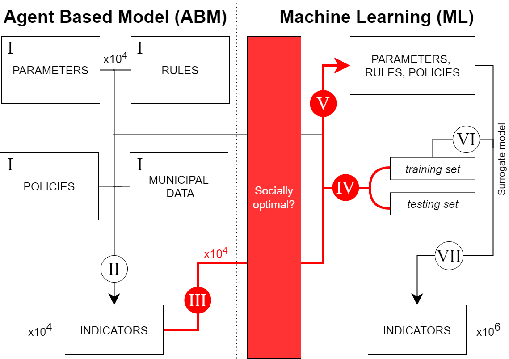
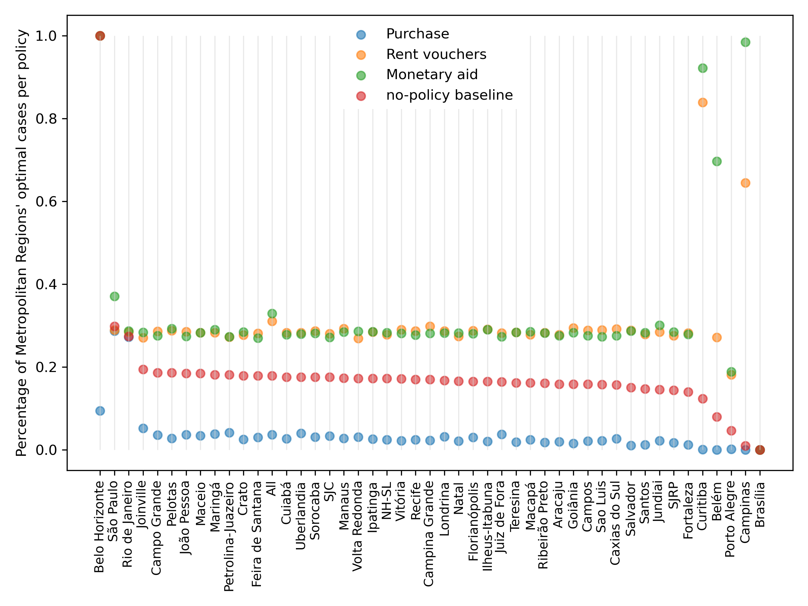

# Machine Learning simulates Agent-based Model towards Policy-Making

Submitted. Under review.

### Proposed scheme:



### Results




### Requires:

````angular2html
python==3.7 numpy==1.20.2 pandas==1.2.4 matplotlib==3.3.4 scipy==1.6.2 scikit-learn==0.24.2
````

The program:

1. Reads output from an ABM model and its parameters' configuration
2. Creates a socioeconomic optimal output based on two ABM results of the modelers choice
3. Organizes the data as X and Y matrices
4. Trains some Machine Learning algorithms
5. Generates random configuration of parameters based on the mean and standard deviation of the original parameters
6. Apply the trained ML algorithms to the set of randomly generated data
7. Outputs the mean and values for the actual data, the randomly generated data and the optimal and non-optimal cases

The original database is large (63.7 GB). 
Thus, we provide pre-processed data to run the programme. 
The code to make the data selection, however, is presented here at `preparing_data.py`

## Running the program
`python main.py`

Output will be produced at the pre_processed folder

With access to the 60 GB original data, it was possible to change the parameters for the targets at main.py. 
We have chosen GDP and Gini coefficient as they carry a powerful, simple message of larger production with less inequality.
Further work--with a combination (PCA) of output indicators in being developed (PolicyMix)

You may change the parameters of the ML in machines.py

Or the size of the sample at generating_random_conf.py

## Figures
1. To produce Figure 2, `cd analysis` and run `python read_comparison.py` to generate IQR.csv
2. Then, run `python plot_alternative_for_table.py`
3. To produce Figure 4, run `python means_comparison.py` and `python counting.py` to generate the input files.
4. Then, run `python plot_z_score_parameters.py`